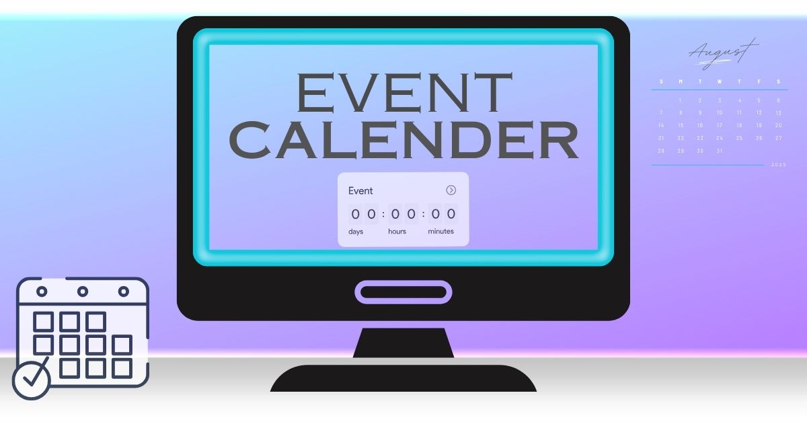

<div align="center">

## My Portfolio 🎓

Showcasing my work, skills, and projects — built with HTML, CSS, and JavaScript. Includes a Node.js email API for the contact form.

[](https://my-portfolio-xc1h.onrender.com)
[](https://github.com/ShubhamSinghRawat10/My-portfolio)
[](LICENSE)

</div>

---

## Preview

<div align="center">
  
</div>

---

## Features

- Modern, responsive UI with smooth animations and scroll spy navigation
- Dark/Light theme toggle with persisted preference
- Projects grid with live demo and GitHub links
- Contact section powered by a Node.js email API (Nodemailer)
- Sections for About, Skills, Education, Certificates, Projects, Interests

## Tech Stack

- Frontend: HTML5, CSS3, JavaScript, Font Awesome
- Backend (Email API): Node.js, Express, Nodemailer, CORS, dotenv

## Live Demo

- Website: https://my-portfolio-xc1h.onrender.com
- Repository: https://github.com/ShubhamSinghRawat10/My-portfolio

## Project Structure

```text
My-portfolio/
├── index.html         # Main site
├── styles.css         # Styles and theming
├── script.js          # Interactivity, theme, animations, contact form
├── server.js          # Email API (Node + Express + Nodemailer)
├── README.md          # This file
├── README_API.md      # Detailed backend/API setup & docs
├── LICENSE            # MIT License
├── SHUBHAMRAWAT_resume.pdf
├── portfolio.jpg      # Preview image
├── blooddonation.jpg  # Project screenshot
├── EVENTCAL.jpg       # Project screenshot
└── profilepic.jpg     # Profile image
```

## Getting Started (Frontend)

You can open `index.html` directly or use a local server for best results.

### Option A: Open directly

1. Download or clone the repo
2. Double-click `index.html`

### Option B: Run with a lightweight server (recommended)

```bash
# Using Node (serve)
npx serve .

# Or using Python 3
python -m http.server 8080
```

Visit `http://localhost:3000` (serve may show the chosen port) or `http://localhost:8080`.

## Contact Form Backend (Email API)

The contact form submits to a simple Node.js email API. Quick start:

```bash
npm install
```

Create a `.env` file in the project root:

```env
EMAIL_USER=your-email@gmail.com
EMAIL_PASS=your-app-password
PORT=3000
```

Start the server:

```bash
# Development (if you add nodemon)
npm run dev

# Or plain Node
npm start
# which runs: node server.js
```

The API listens on `http://localhost:3000`.

For full instructions and production advice (rate limiting, CORS, providers), see `README_API.md`.

### API Endpoints

- GET `/api/health` → `{ status: 'OK' }`
- POST `/api/send-email`

Request body:

```json
{
  "name": "John Doe",
  "email": "john@example.com",
  "message": "Hello! I'd like to connect."
}
```

Successful response:

```json
{ "success": true, "message": "Email sent successfully!" }
```

## Screenshots

<table>
  <tr>
    <td align="center"><strong>Portfolio</strong></td>
    <td align="center"><strong>Blood Donation</strong></td>
    <td align="center"><strong>Event Calendar</strong></td>
  </tr>
  <tr>
    <td></td>
    <td></td>
    <td></td>
  </tr>
  <tr>
    <td align="center">HTML • CSS • JS</td>
    <td align="center">HTML • CSS • JS</td>
    <td align="center">HTML • CSS • JS</td>
  </tr>
  <tr>
    <td align="center"><a href="https://my-portfolio-xc1h.onrender.com" target="_blank">Live</a></td>
    <td align="center"><a href="https://blood-donation-website-atid.onrender.com" target="_blank">Live</a></td>
    <td align="center"><a href="https://shubhamsinghrawat10.github.io/Event-Calender/" target="_blank">Live</a></td>
  </tr>
</table>

## Development Notes

- The theme toggle persists via `localStorage`
- Smooth scrolling and section highlighting are implemented in `script.js`
- Contact form fetches `POST /api/send-email` and shows loading states

## Roadmap / Ideas

- Add project filters and tags
- Add blog/notes section
- Deploy the API to a managed service with HTTPS

## Contact

- Email: `shubhamsinghrawat01@gmail.com`
- GitHub: `@ShubhamSinghRawat10`
- LinkedIn: `shubham-singh-rawat-a31789290`

If you like this project, please consider giving it a ⭐ on GitHub!

## License

This project is licensed under the MIT License — see [`LICENSE`](LICENSE) for details.

